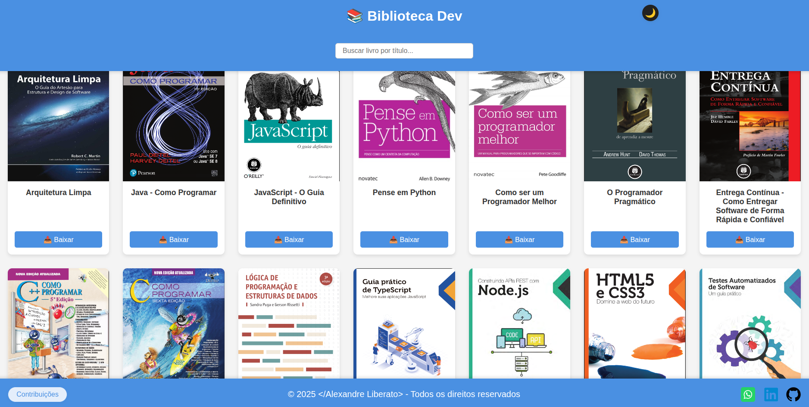

  

  <h3> 
    Bem-vindo à Biblioteca Dev
       
  </h3>   

 

  

  

 

  

## 💡 Visão Geral

A **Biblioteca Dev** é um projeto sem fins lucrativos criado para ajudar outros desenvolvedores, estudantes e entusiastas de tecnologia. Aqui você encontra uma coleção de livros digitais sobre programação, desenvolvimento de software, boas práticas, linguagens e ferramentas essenciais para quem deseja evoluir na carreira de TI.

O objetivo é compartilhar conhecimento e facilitar o acesso a materiais de qualidade, promovendo o crescimento da comunidade dev.

---

## 🚀 Funcionalidades
- 🔎 Busca rápida de livros por título
- 📖 Visualização de detalhes dos livros em modal
- 📥 Download direto dos livros em PDF
- 💻 Interface moderna, responsiva e acessível
- 💸 Modal de contribuição Pix (opcional)
- 🌗 Modo claro/escuro

---

## 🧑‍💻 Como usar
1. Abra o arquivo `index.html` em seu navegador.
2. Utilize a barra de busca para encontrar livros rapidamente.
3. Clique na capa para ver detalhes ou no botão "Baixar" para fazer o download.
4. Se desejar, contribua para o projeto usando a chave Pix informada no site.

---

## ⚠️ Aviso
Este projeto é **exclusivamente educacional** e tem como único propósito ajudar outros devs. Não há qualquer intenção comercial ou de violação de direitos autorais. Caso você seja detentor de algum conteúdo e deseje sua remoção, entre em contato.

---

## 📞 Contato

  
  
  
  

 

 

  <b>Feito com carinho para a comunidade dev! 🚀</b>

